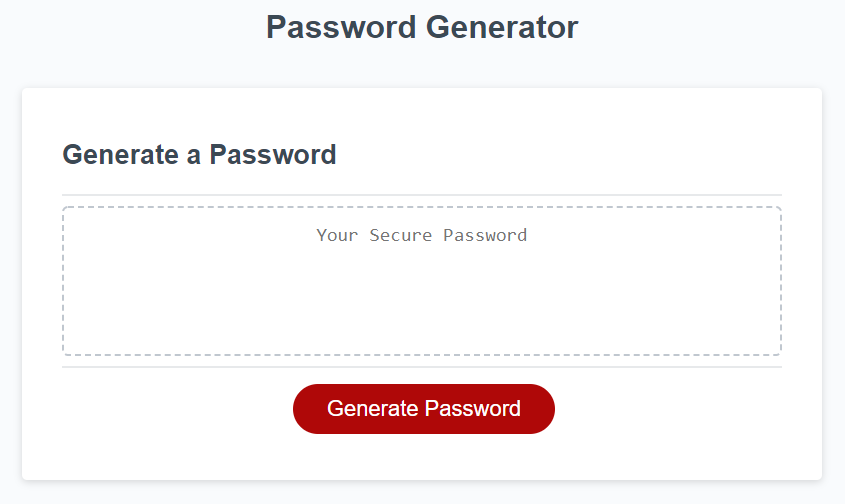

# Editing this README

When you're ready to make this README your own, just edit this file and use the handy template below (or feel free to structure it however you want - this is just a starting point!). Thank you to [makeareadme.com](https://www.makeareadme.com/) for this template.

## Suggestions for a good README
Every project is different, so consider which of these sections apply to yours. The sections used in the template are suggestions for most open source projects. Also keep in mind that while a README can be too long and detailed, too long is better than too short. If you think your README is too long, consider utilizing another form of documentation rather than cutting out information.

## Name
Password Generator

## Description
This program prompts the user as to what length password they desire (from 8 to 128 characters), as well as what types of characters they want included into the password.  Invalid password lengths or not accepting any characters will terminate the program.

## Badges

## Visuals

## Installation
NA

## Usage
Example of a 12 character password with capital letter and symbols only - CWVH4JU1IKUI

## Support
Email me at matt@mmcprintpackaging.com.

## Contributing
I am always open to suggestions for improvement.  Send those to email above. 

## Authors and acknowledgment
Bobbi Tarkany is awesome and was very helpful to this project.

## License
NA

